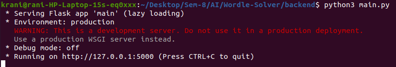

# Wordle-Solver
### Description
Wordle-Solver is a program written in python (backend) to help people play the game [WORDLE] (https://en.wikipedia.org/wiki/Wordle). Based on a hueristic metric, Wordle-Solver helps WORDLE players find the best words for the next try.The program uses every bit of information gained from WORDLE's reponse to calculate the selection probabilities of the words using the hueristic metric. The responses from the tries will help Wordle-Solver narrow down to a single, if not a few, possible English word(s).


# Usage

### Cloning Repo
```
git clone https://github.com/Code-Blooded-Human/Wordle-Solver.git
```


### Install the dependencies
```
cd Wordle-Solver
cd backend
pip3 install -r requirements.txt
```


### Run the Wordle-Solver
```
python3 main.py
```

### Open WORDLE User Interface
Open ``` ui/index.html ``` file in a web browswer.


# Demo
Lets Play the game now. Enter the word suggested in the User Interface of the appication into the [WORDLE Game] (https://www.nytimes.com/games/wordle/index.html). Pass on the hints received from the WORDLE game into the user interface by clicking the letter tiles and then click on guess new word. Below are the attached screenshots of the game played using this application.


